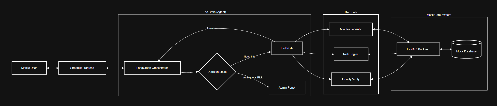

Interbank Agente X 💚 | Agentic AI Banking Assistant

Agente X is not just a chatbot. It is an Autonomous Banking Employee capable of negotiating loan terms, assessing credit risk, and executing transactions on the Mainframe, all while adhering to strict safety protocols and Interbank's visual identity.

🚀 The Problem vs. The Solution

The Problem: Current banking chatbots suffer from "Analysis Paralysis." They can summarize policies but cannot execute complex workflows like originating a loan, forcing users to fill out manual web forms.

The Solution: A 3-Brain Architecture that combines:

Generative AI (GPT-4o): For natural, empathetic communication.

Predictive AI (Risk Engine): To calculate financial viability in real-time.

Agentic AI (LangGraph): To orchestrate tools, manage state, and execute secure transactions.

✨ Key Features

🧠 Cognitive Architecture: Uses LangGraph to maintain conversation state and cyclically reason through problems.

🛡️ Human-in-the-Loop Safety: Automatically detects "Ambiguous Risk" (Credit Score 600-700) and halts execution to request Manager Approval via a secure Admin Panel.

💳 End-to-End Loan Origination: Handles Identity Verification (KYC), Credit Checks, Risk Assessment, and Fund Disbursement autonomously.

📉 Intelligent Negotiation: Analyzes the user's debt capacity and proactively suggests optimal loan terms (e.g., extending terms to lower monthly payments) to ensure financial health.

🎨 Interbank Identity: Fully styled with Interbank's specific color palette (#059c5b), typography, and mobile-responsive design.

🏗️ Architecture

🛠️ Installation & Setup

Prerequisites

Python 3.10+

OpenAI API Key

1. Clone the Repository

git clone [https://github.com/samgbm/Interbank-Agente-X-Agentic-AI-Banking-Assistant.git](https://github.com/samgbm/Interbank-Agente-X-Agentic-AI-Banking-Assistant.git)
cd Interbank-Agente-X-Agentic-AI-Banking-Assistant

2. Create a Virtual Environment

python -m venv venv
source venv/bin/activate  # On Windows: venv\Scripts\activate

3. Install Dependencies

pip install streamlit langgraph langchain-openai fastapi uvicorn requests

4. Set Environment Variables

Export your OpenAI API Key (or create a .env file):

export OPENAI_API_KEY="sk-proj-..."
# On Windows (PowerShell): $env:OPENAI_API_KEY="sk-proj-..."

⚡ How to Run

This application requires two terminal windows running simultaneously (Microservices Architecture).

Terminal 1: Core Banking System (Backend)

This simulates the Mainframe, Credit Bureau, and Customer Database.

uvicorn banking_api:app --reload --port 8000

API docs available at: http://127.0.0.1:8000/docs

Terminal 2: Agent Interface (Frontend)

This runs the Streamlit application.

streamlit run app.py

🧪 Test Scenarios (Demo Scripts)

Scenario A: The Happy Path (Instant Approval)

Login: Type user_123

Request: "Quiero un préstamo de $5,000."

Result: The Agent validates identity (Alice), checks score (750), approves risk, and disburses funds immediately.

Scenario B: The Smart Negotiator (Financial Advice)

Login: Type user_123

Request: "Quiero $50,000 a 12 meses."

Result: The Agent detects the monthly payment exceeds 40% of income. It refuses the term but suggests extending it to 48 months to fit the budget.

Scenario C: The Safety Stop (Human-in-the-Loop)

Login: Type user_789 (Charlie, Medium Risk).

Request: "Quiero $2,000."

Result: The Agent halts: "Necesito aprobación del Gerente."

Action: Go to Sidebar → Click ✅ Aprobar Crédito.

Outcome: The Agent detects the override and executes the transaction.

📂 Project Structure

├── app.py              # Main Frontend & Agent Logic (Streamlit + LangGraph)
├── banking_api.py      # Mock Core Banking System (FastAPI)
├── requirements.txt    # Project dependencies
└── README.md           # Documentation

🔮 Future Roadmap

Voice Interface: Integration with OpenAI Whisper for phone banking.

Real Mainframe: Replace Mock API with IBM z/OS Connect.

Multi-Modal: Allow users to upload pay stubs (PDF/Images) for income verification.

Built for Interbank Hackathon 2025. "El tiempo vale más que el dinero."

